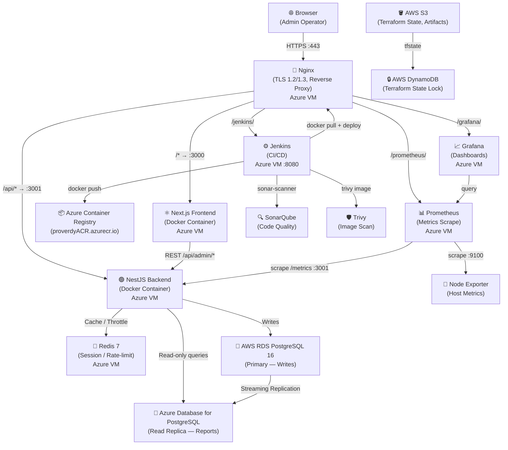
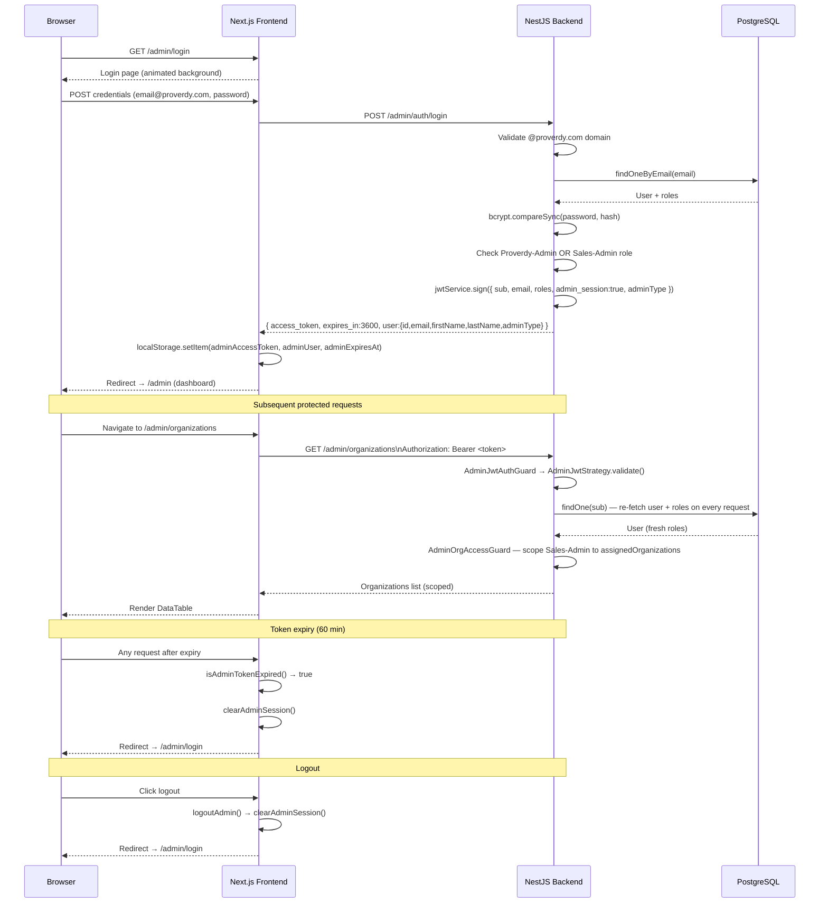
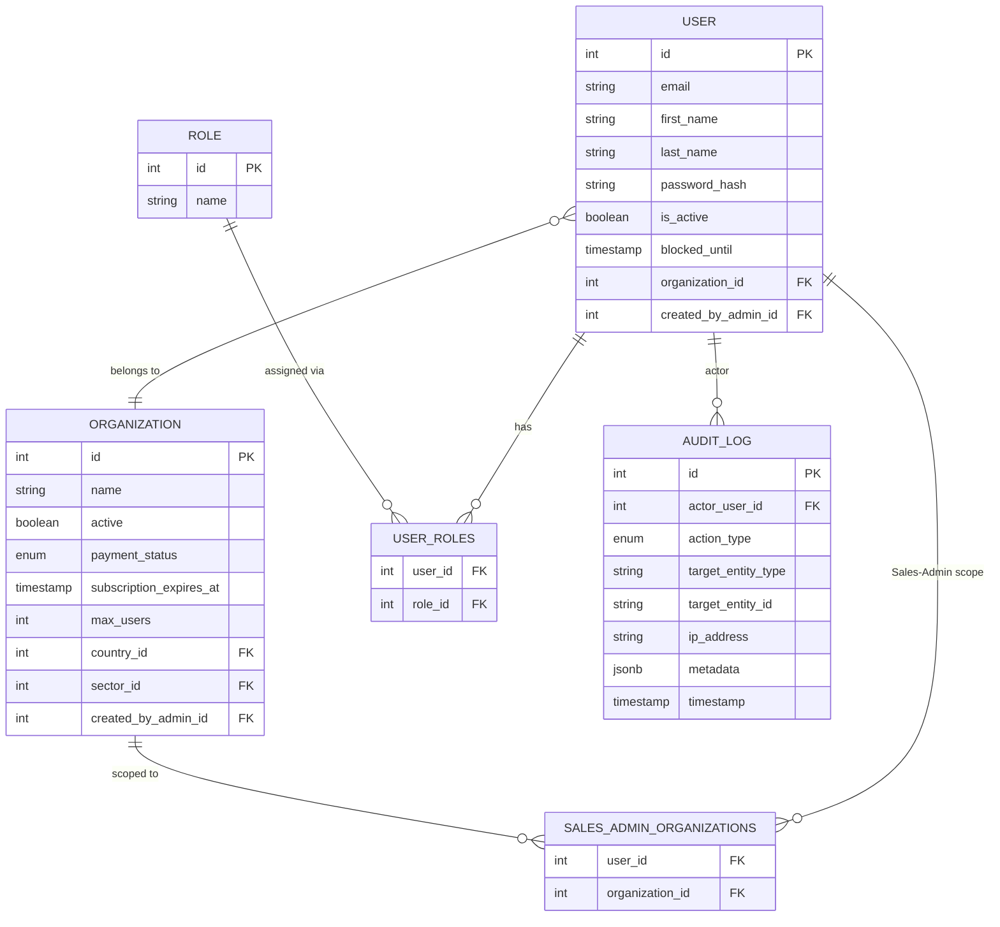
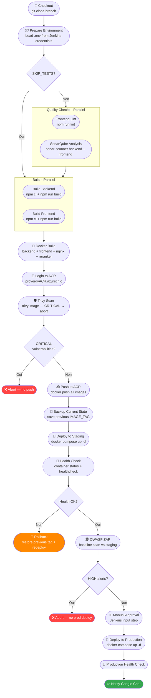
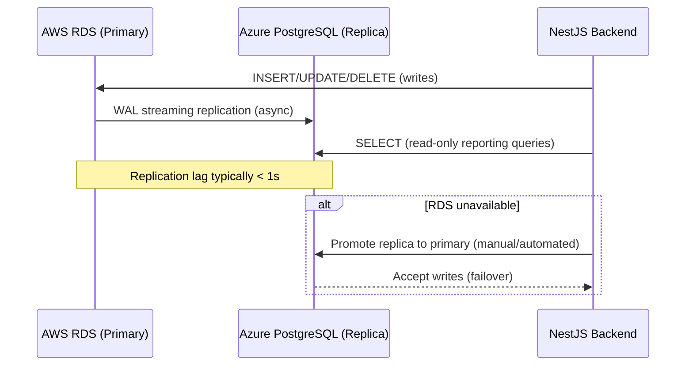

# Document de Conception — SaaS Admin Platform

## Vue d'ensemble

La **SaaS Admin Platform** est l'interface d'administration interne de Proverdy, construite sur un backend NestJS existant et un frontend Next.js. Elle permet aux opérateurs `Proverdy-Admin` (accès total) et `Sales-Admin` (accès restreint à leurs organisations assignées) de gérer le cycle de vie complet des tenants, des utilisateurs, des abonnements, et d'observer l'infrastructure en temps réel.

Ce document de conception couvre l'architecture globale multi-cloud (AWS + Azure), la structure des modules NestJS, les pages Next.js, le schéma de base de données, le catalogue d'API, le pipeline CI/CD Jenkins, et les propriétés de correction pour les tests basés sur les propriétés.

---

## 1. Architecture Globale (AWS + Azure)



### Topologie réseau

| Composant | Cloud | Type | Rôle |
|---|---|---|---|
| Azure VM (app) | Azure | VM Standard_B2s | Nginx + Frontend + Backend + Redis |
| Azure VM (ops) | Azure | VM Standard_B2s | Jenkins + Prometheus + Grafana + SonarQube |
| Azure Container Registry | Azure | ACR Basic | Stockage images Docker |
| Azure Database for PostgreSQL | Azure | Flexible Server | Réplica lecture |
| AWS RDS PostgreSQL 16 | AWS | db.t3.medium | Base primaire (écriture) |
| AWS S3 | AWS | Standard | État Terraform + artefacts CI |
| AWS DynamoDB | AWS | On-demand | Verrou état Terraform |
| AWS IAM | AWS | Roles/Policies | Least-privilege access |

---

## 2. Flux d'Authentification (Sequence Diagram)



---

## 3. Architecture des Modules NestJS

```mermaid
graph TD
    AppModule["AppModule\n(app.module.ts)"]
    AdminModule["AdminModule\n(admin.module.ts)"]

    subgraph "Existing Sub-modules"
        AuthMod["AdminAuthModule\nAdminAuthController\nAdminAuthService\nAdminJwtStrategy\nRequireProverdyAdminGuard"]
        OrgsMod["AdminOrganizationsModule\nAdminOrganizationsController\nAdminOrganizationUsersController\nAdminOrganizationsService\nAdminOrganizationUsersService"]
        UsersMod["AdminUsersModule\nAdminUsersController\nAdminUsersService"]
        FacMod["AdminFacilitiesModule\nAdminFacilitiesController"]
    end

    subgraph "New Sub-modules (to implement)"
        DashMod["AdminDashboardModule\nAdminDashboardController\nAdminDashboardService"]
        AuditMod["AdminAuditLogModule\nAdminAuditLogController\nAdminAuditLogService\nAuditLogInterceptor\nAuditLog entity"]
        SubMod["AdminSubscriptionModule\nSubscriptionScheduler\n@Cron every 60min"]
        DevOpsMod["AdminDevOpsModule\nAdminDevOpsController\nAdminDevOpsService\n(Jenkins proxy + Trivy/SonarQube)"]
    end

    subgraph "Global Guards (APP_GUARD)"
        JwtGuard["JwtAuthGuard\n(skips /admin/*)"]
        OrgGuard["AdminOrgAccessGuard\n(scopes Sales-Admin)"]
        ActiveGuard["ActiveOrganizationGuard\n(skips /admin/*)"]
        ThrottleGuard["ThrottlerGuard\n(100 req/60s)"]
    end

    AppModule --> AdminModule
    AdminModule --> AuthMod
    AdminModule --> OrgsMod
    AdminModule --> UsersMod
    AdminModule --> FacMod
    AdminModule --> DashMod
    AdminModule --> AuditMod
    AdminModule --> SubMod
    AdminModule --> DevOpsMod
    AppModule --> JwtGuard
    AppModule --> OrgGuard
    AppModule --> ActiveGuard
    AppModule --> ThrottleGuard
```



### Dépendances des modules NestJS

| Module | Imports TypeORM | Services injectés |
|---|---|---|
| AdminModule | User, Organization, Role, Invitation | UsersModule, CountriesModule, SectorsModule, CurrenciesModule, FacilitiesModule, JwtModule |
| AdminDashboardModule (new) | Organization, User | TypeORM EntityManager |
| AdminAuditLogModule (new) | AuditLog (new entity) | — |
| AdminSubscriptionModule (new) | Organization | ScheduleModule |
| AdminDevOpsModule (new) | — | HttpModule (Jenkins proxy) |


---

## 4. Structure des Pages et Composants Next.js

```
app/(admin)/
├── layout.tsx                          # [EXISTING] AdminAuthProvider, auth guard, redirect logic
│
├── admin/
│   ├── page.tsx                        # [EXTEND] Dashboard KPI — KPI cards, Recharts charts, recent orgs, Grafana iframe, Jenkins widget
│   ├── login/
│   │   └── page.tsx                    # [EXISTING] Login form, animated background, @proverdy.com enforcement
│   │
│   ├── organizations/
│   │   ├── page.tsx                    # [EXISTING] PrimeReact DataTable, pagination, search, filters, CreateOrganizationModal
│   │   └── [id]/
│   │       ├── page.tsx                # [EXISTING] Org detail + users table, edit/activate/deactivate/add user
│   │       └── data/
│   │           └── page.tsx            # [EXISTING] Embeds Dashboard/EmissionsData/Facilities with fake AuthContext + fetch interceptor
│   │
│   ├── users/
│   │   ├── page.tsx                    # [EXISTING] Filterable users list (all/created-by-admin/self-registered/proverdy-admin/sales-admin)
│   │   ├── [id]/
│   │   │   └── page.tsx               # [EXISTING] User detail, GrantRevokeAdminRole, SalesAdminOrgsPanel
│   │   ├── created-by-admin/
│   │   │   └── page.tsx               # [EXISTING] Redirect → /admin/users?filter=created-by-admin
│   │   └── self-registered/
│   │       └── page.tsx               # [EXISTING] Redirect → /admin/users?filter=self-registered
│   │
│   ├── audit-logs/
│   │   └── page.tsx                    # [NEW] Filterable AuditLog DataTable — Proverdy-Admin only
│   │
│   ├── devops/
│   │   └── page.tsx                    # [NEW] Jenkins builds table, Prometheus metrics cards, Docker image tags
│   │
│   └── security/
│       └── page.tsx                    # [NEW] Trivy scan results per image, SonarQube quality gate status
│
├── components/
│   ├── AdminSidebar.tsx                # [EXISTING] Nav links, avatar, role label, logout
│   ├── AdminTopbar.tsx                 # [EXISTING] Page title, role display, CTA button
│   ├── KpiCard.tsx                     # [NEW] Reusable KPI metric card with trend indicator
│   ├── OrgRegistrationsChart.tsx       # [NEW] Recharts AreaChart — org registrations per month (12m)
│   ├── ActiveUsersChart.tsx            # [NEW] Recharts LineChart — active users per day (30d)
│   ├── RecentOrgsTable.tsx             # [NEW] Last 10 created orgs with paymentStatus + expiry
│   ├── GrafanaPanel.tsx                # [NEW] Iframe wrapper for Grafana embed
│   ├── JenkinsBuildWidget.tsx          # [NEW] Last 10 builds status table
│   ├── AuditLogTable.tsx               # [NEW] Paginated + filterable audit log DataTable
│   ├── TrivyScanResults.tsx            # [NEW] Per-image severity badges (CRITICAL/HIGH/MEDIUM/LOW)
│   └── SonarQubeStatus.tsx             # [NEW] Quality gate badge + bug/vuln/smell counts
│
└── services/
    ├── adminApi.ts                     # [EXISTING] fetch wrapper, auto-attaches Bearer token from localStorage
    ├── adminAuthService.ts             # [EXISTING] loginAdmin, setAdminSession, clearAdminSession, isAdminTokenExpired
    └── AdminAuthContext.tsx            # [EXISTING] adminUser, adminToken, isAdminAuthenticated, loginAdminUser, logoutAdmin
```

### Comportement par rôle (frontend)

| Fonctionnalité | Proverdy-Admin | Sales-Admin |
|---|---|---|
| Dashboard KPI (toutes orgs) | ✅ | ❌ (KPIs filtrés sur orgs assignées) |
| Créer / modifier / supprimer orgs | ✅ | ❌ (bannière read-only) |
| Créer / modifier / supprimer users | ✅ | ❌ |
| Accorder / révoquer rôles admin | ✅ | ❌ |
| Assigner orgs à Sales-Admin | ✅ | ❌ |
| Voir liste orgs | Toutes | Orgs assignées (scoped serveur) |
| Voir données org | ✅ | ✅ |
| Page Audit Logs | ✅ | ❌ (lien masqué dans sidebar) |
| Page DevOps | ✅ | ❌ |
| Page Security | ✅ | ❌ |

---

## 5. Schéma de Base de Données

### Tables existantes

#### `user`
| Colonne | Type | Contraintes |
|---|---|---|
| id | SERIAL | PK |
| email | VARCHAR(255) | UNIQUE, NOT NULL |
| first_name | VARCHAR(255) | NOT NULL |
| last_name | VARCHAR(255) | NOT NULL |
| phone | VARCHAR(255) | NULL |
| password_hash | VARCHAR(255) | NOT NULL |
| failed_login_attempts | INT | DEFAULT 0 |
| last_failed_login | TIMESTAMP | NULL |
| blocked_until | TIMESTAMP | NULL |
| email_verified | BOOLEAN | DEFAULT false |
| email_confirmation_token | VARCHAR(255) | NULL |
| email_confirmation_expires_at | TIMESTAMP | NULL |
| is_active | BOOLEAN | DEFAULT true |
| created_at | TIMESTAMP | DEFAULT NOW() |
| deleted_at | TIMESTAMP | NULL (soft delete) |
| organization_id | INT | FK → organization.id |
| position_id | INT | FK → position.id |
| created_by_admin_id | INT | FK → user.id (self-ref) |

#### `organization`
| Colonne | Type | Contraintes |
|---|---|---|
| id | SERIAL | PK |
| name | VARCHAR(255) | NOT NULL |
| country_id | INT | FK → country.id, NOT NULL |
| sector_id | INT | FK → sector.id, NOT NULL |
| currency_id | INT | FK → currency.id, NULL |
| employees_num | INT | NOT NULL |
| active | BOOLEAN | NOT NULL |
| address | VARCHAR(255) | NULL |
| parent_id | INT | NULL (self-ref hierarchy) |
| hear_about_us | INT | NULL |
| logo | BYTEA | NULL |
| onboarding | TEXT | NULL (simple-array) |
| selected_year | INT | NULL |
| payment_status | ENUM('paid','unpaid','trial','not_applicable') | DEFAULT 'not_applicable' |
| subscription_starts_at | TIMESTAMP | NULL |
| subscription_expires_at | TIMESTAMP | NULL |
| max_users | INT | NULL |
| created_at | TIMESTAMP | DEFAULT NOW() |
| deleted_at | TIMESTAMP | NULL (soft delete) |
| created_by_admin_id | INT | FK → user.id |

#### `role`
| Colonne | Type | Contraintes |
|---|---|---|
| id | SERIAL | PK |
| name | VARCHAR(255) | UNIQUE, NOT NULL |

Valeurs : `User` (1), `Admin` (2), `Super Admin` (3), `Proverdy-Admin` (4), `Sales-Admin` (5)

#### `user_roles` (join table)
| Colonne | Type | Contraintes |
|---|---|---|
| user_id | INT | FK → user.id, PK composite |
| role_id | INT | FK → role.id, PK composite |

#### `sales_admin_organizations` (join table)
| Colonne | Type | Contraintes |
|---|---|---|
| user_id | INT | FK → user.id, PK composite |
| organization_id | INT | FK → organization.id, PK composite |

### Nouvelle table : `audit_log`

| Colonne | Type | Contraintes |
|---|---|---|
| id | SERIAL | PK |
| actor_user_id | INT | NOT NULL, FK → user.id |
| action_type | ENUM('CREATE','UPDATE','DELETE','LOGIN','LOGOUT') | NOT NULL |
| target_entity_type | VARCHAR(100) | NOT NULL (ex: 'Organization', 'User') |
| target_entity_id | VARCHAR(100) | NULL (NULL pour LOGIN/LOGOUT) |
| ip_address | VARCHAR(45) | NULL (IPv4 ou IPv6) |
| metadata | JSONB | NULL (diff avant/après pour UPDATE) |
| timestamp | TIMESTAMP | DEFAULT NOW(), NOT NULL |

Index recommandés : `(actor_user_id)`, `(action_type)`, `(target_entity_type, target_entity_id)`, `(timestamp DESC)`

### Diagramme ERD (relations clés)




---

## 6. Catalogue des Endpoints API

Tous les endpoints sont préfixés `/admin`. Le guard `AdminJwtAuthGuard` est appliqué globalement sur tous les endpoints sauf `/admin/auth/login`.

### Authentification

| Méthode | Chemin | Guards | Description | Statut |
|---|---|---|---|---|
| POST | `/admin/auth/login` | ThrottlerGuard (20 req/min) | Login admin, retourne JWT | Existant |

### Organisations

| Méthode | Chemin | Guards | Description | Statut |
|---|---|---|---|---|
| GET | `/admin/organizations` | AdminJwt + OrgAccess | Liste paginée + filtrée (Sales-Admin scopé) | Existant |
| GET | `/admin/organizations/:id` | AdminJwt + OrgAccess | Détail organisation | Existant |
| POST | `/admin/organizations` | AdminJwt + ProverdyAdmin | Créer organisation | Existant |
| PATCH | `/admin/organizations/:id` | AdminJwt + ProverdyAdmin | Modifier organisation | Existant |
| PATCH | `/admin/organizations/:id/activate` | AdminJwt + ProverdyAdmin | Activer/désactiver | Existant |
| DELETE | `/admin/organizations/:id` | AdminJwt + ProverdyAdmin | Soft delete | Existant |

### Utilisateurs d'organisation

| Méthode | Chemin | Guards | Description | Statut |
|---|---|---|---|---|
| GET | `/admin/organizations/:orgId/users` | AdminJwt + OrgAccess | Liste users de l'org | Existant |
| GET | `/admin/organizations/:orgId/users/:userId` | AdminJwt + OrgAccess | Détail user | Existant |
| POST | `/admin/organizations/:orgId/users` | AdminJwt + ProverdyAdmin | Créer user dans org (maxUsers enforced) | Existant |
| PATCH | `/admin/organizations/:orgId/users/:userId` | AdminJwt + ProverdyAdmin | Modifier user | Existant |
| DELETE | `/admin/organizations/:orgId/users/:userId` | AdminJwt + ProverdyAdmin | Soft delete user | Existant |

### Utilisateurs admin

| Méthode | Chemin | Guards | Description | Statut |
|---|---|---|---|---|
| GET | `/admin/users/created-by-admin` | AdminJwt | Users créés par admin | Existant |
| GET | `/admin/users/self-registered` | AdminJwt | Users auto-inscrits | Existant |
| GET | `/admin/users/proverdy-admin` | AdminJwt | Tous les Proverdy-Admin | Existant |
| GET | `/admin/users/sales-admin` | AdminJwt | Tous les Sales-Admin | Existant |
| GET | `/admin/users/:id` | AdminJwt | Détail user | Existant |
| POST | `/admin/users/:id/grant-admin-role` | AdminJwt + ProverdyAdmin | Accorder rôle admin | Existant |
| DELETE | `/admin/users/:id/revoke-admin-role` | AdminJwt + ProverdyAdmin | Révoquer rôle admin | Existant |
| POST | `/admin/users/:id/organizations` | AdminJwt + ProverdyAdmin | Assigner orgs à Sales-Admin | Existant |

### Installations (Facilities)

| Méthode | Chemin | Guards | Description | Statut |
|---|---|---|---|---|
| GET | `/admin/organizations/:organizationId/facilities` | AdminJwt | Liste installations (read-only, proxy FacilitiesService) | Existant |

### Dashboard KPI (nouveau)

| Méthode | Chemin | Guards | Description | Statut |
|---|---|---|---|---|
| GET | `/admin/dashboard/kpi` | AdminJwt | KPIs agrégés + time-series (≤2s) | **Nouveau** |

Réponse attendue :
```typescript
{
  totalOrgs: number,
  activeOrgs: number,
  totalUsers: number,
  newUsersLast30Days: number,
  orgsByPaymentStatus: { paid: number, unpaid: number, trial: number, not_applicable: number },
  orgRegistrationsPerMonth: Array<{ month: string, count: number }>,  // 12 derniers mois
  activeUsersPerDay: Array<{ date: string, count: number }>,           // 30 derniers jours
  expiringSubscriptions: Array<{ id: number, name: string, subscriptionExpiresAt: string }>
}
```

### Audit Logs (nouveau)

| Méthode | Chemin | Guards | Description | Statut |
|---|---|---|---|---|
| GET | `/admin/audit-logs` | AdminJwt + ProverdyAdmin | Liste paginée + filtrée | **Nouveau** |

Query params : `page`, `pageSize` (max 100), `actorUserId`, `actionType`, `targetEntityType`, `dateFrom`, `dateTo`

### DevOps (nouveau)

| Méthode | Chemin | Guards | Description | Statut |
|---|---|---|---|---|
| GET | `/admin/devops/pipeline-status` | AdminJwt + ProverdyAdmin | Proxy Jenkins REST API — 10 derniers builds | **Nouveau** |
| GET | `/admin/devops/security-scans` | AdminJwt + ProverdyAdmin | Résultats Trivy + SonarQube | **Nouveau** |

### Métriques (existant)

| Méthode | Chemin | Guards | Description | Statut |
|---|---|---|---|---|
| GET | `/metrics` | Aucun (Prometheus scrape) | Exposition format Prometheus | Existant |

---

## 7. Pipeline CI/CD Jenkins



### Stages détaillés

| Stage | Outil | Condition d'échec | Artefact produit |
|---|---|---|---|
| Checkout | git | Branche inaccessible | — |
| Prepare Environment | Jenkins credentials | Secret manquant | `.env` injecté |
| Frontend Lint | ESLint + Prettier | Toute erreur lint | — |
| SonarQube Analysis | sonar-scanner | Quality Gate FAILED | Rapport SonarQube |
| Build Backend | npm ci + tsc | Erreur compilation | `dist/` |
| Build Frontend | npm ci + next build | Erreur build | `.next/` |
| Docker Build | docker build | Erreur Dockerfile | Images locales |
| Trivy Scan | trivy image | Vulnérabilité CRITICAL | `trivy-report.html` |
| Push to ACR | docker push | Auth ACR échouée | Images dans ACR |
| Deploy Staging | docker compose | Conteneur non démarré | — |
| Health Check | docker inspect | Conteneur unhealthy | — |
| OWASP ZAP | zap-baseline.py | Alerte HIGH | `zap-report.html` |
| Manual Approval | Jenkins input | Timeout 24h | — |
| Deploy Production | docker compose | Conteneur non démarré | — |

### Notifications

Les notifications Google Chat sont envoyées via webhook (`google-chat-webhook` credential Jenkins) à chaque fin de pipeline (SUCCESS / FAILURE / UNSTABLE) avec : job name, build number, image tag, durée, branche, commit, message.

---

## 8. Infrastructure Multi-Cloud (IaC)

### Structure Terraform

```
infrastructure/
├── terraform/
│   ├── aws/
│   │   ├── main.tf              # Provider AWS, backend S3+DynamoDB
│   │   ├── ec2.tf               # EC2 instances (app servers)
│   │   ├── rds.tf               # RDS PostgreSQL 16 (primary)
│   │   ├── s3.tf                # S3 buckets (tfstate, artifacts)
│   │   ├── iam.tf               # IAM roles + policies (least-privilege)
│   │   ├── vpc.tf               # VPC, subnets, security groups
│   │   └── variables.tf
│   ├── azure/
│   │   ├── main.tf              # Provider AzureRM
│   │   ├── vm.tf                # VMs (app + ops)
│   │   ├── acr.tf               # Azure Container Registry
│   │   ├── postgresql.tf        # Azure Database for PostgreSQL (replica)
│   │   ├── network.tf           # VNet, NSG, public IPs
│   │   └── variables.tf
│   └── modules/
│       ├── postgres-replication/ # Module réplication AWS→Azure
│       └── monitoring/           # Module Prometheus + Grafana
└── ansible/
    ├── inventory/
    │   ├── production.ini
    │   └── staging.ini
    ├── playbooks/
    │   ├── site.yml             # Playbook principal
    │   ├── docker.yml           # Install Docker + Docker Compose
    │   ├── jenkins.yml          # Install + configure Jenkins
    │   ├── monitoring.yml       # Prometheus + Grafana + Node Exporter
    │   ├── nginx.yml            # Nginx + TLS (certs depuis Deployment/nginx/ssl/)
    │   └── sonarqube.yml        # SonarQube
    ├── roles/
    │   ├── docker/
    │   ├── jenkins/
    │   ├── nginx/
    │   └── monitoring/
    └── vault/
        └── secrets.yml          # Ansible Vault (chiffré)
```

### Ressources AWS

| Ressource | Type | Configuration |
|---|---|---|
| EC2 App Server | t3.medium | Amazon Linux 2, Docker, Docker Compose |
| RDS PostgreSQL | db.t3.medium | PostgreSQL 16, Multi-AZ, encryption at rest |
| S3 Terraform State | Standard | Versioning activé, encryption SSE-S3 |
| S3 Artifacts | Standard | Rapports CI (Trivy, ZAP) |
| DynamoDB Lock | On-demand | Table `terraform-state-lock` |
| IAM Role (EC2) | — | S3 read, ECR pull, CloudWatch logs |
| VPC | — | Subnets publics/privés, Security Groups |

### Ressources Azure

| Ressource | Type | Configuration |
|---|---|---|
| VM App | Standard_B2s | Ubuntu 22.04, Docker, Nginx |
| VM Ops | Standard_B2s | Ubuntu 22.04, Jenkins, Prometheus, Grafana |
| Azure Container Registry | Basic | proverdyACR, admin enabled |
| Azure Database for PostgreSQL | Flexible Server | PostgreSQL 16, read replica d'AWS RDS |
| VNet | — | NSG : 80, 443, 8080 (Jenkins), 22 (SSH) |

### Réplication PostgreSQL (AWS → Azure)



### Tags Terraform obligatoires

```hcl
tags = {
  project    = "proverdy-admin-platform"
  environment = var.environment  # "production" | "staging"
  managed-by = "terraform"
  owner      = "proverdy-devops"
}
```


---

## 9. Tableaux Comparatifs Technologiques

### 9.1 Frontend Framework

| Critère | Next.js ✅ | Angular | Vue.js |
|---|---|---|---|
| Performance | SSR/SSG natif, App Router, streaming | SPA par défaut, SSR via Angular Universal | SSR via Nuxt.js |
| Scalabilité | Excellent (Vercel/Docker) | Bon (Angular Universal) | Bon (Nuxt) |
| Sécurité | Headers CSP, HTTPS natif, middleware auth | Guards intégrés, DI strict | Guards via plugins |
| Complexité | Modérée (App Router learning curve) | Élevée (DI, decorators, modules) | Faible à modérée |
| Courbe d'apprentissage | Modérée (React requis) | Élevée | Faible |
| Écosystème | Très riche (React ecosystem) | Riche (Google-backed) | Riche |
| **Conclusion** | **Choisi** — SSR natif, TypeScript first, intégration React components existants | Non retenu — complexité excessive pour un projet PFE | Non retenu — moins adapté à l'existant React |

### 9.2 Backend Framework

| Critère | NestJS ✅ | Express.js | Spring Boot |
|---|---|---|---|
| Performance | Bon (Node.js, async I/O) | Excellent (minimal overhead) | Excellent (JVM optimisé) |
| Scalabilité | Modules, microservices ready | Manuel | Excellent (Spring Cloud) |
| Sécurité | Guards, interceptors, class-validator | Manuel | Spring Security (très complet) |
| Complexité | Modérée (decorators, DI) | Faible | Élevée (JVM, Maven/Gradle) |
| Courbe d'apprentissage | Modérée (Angular-like) | Faible | Élevée |
| TypeScript | Natif | Via ts-node | Non (Java) |
| **Conclusion** | **Choisi** — Architecture modulaire, TypeScript natif, guards/interceptors pour RBAC et audit | Non retenu — pas de structure imposée, difficile à maintenir | Non retenu — changement de langage, complexité JVM |

### 9.3 ORM

| Critère | TypeORM ✅ | Prisma | Sequelize |
|---|---|---|---|
| Performance | Bon (lazy loading, query builder) | Excellent (generated queries) | Bon |
| Scalabilité | Bon (migrations, entities) | Excellent (schema-first) | Bon |
| Sécurité | Parameterized queries | Parameterized queries | Parameterized queries |
| Complexité | Modérée (decorators) | Faible (schema.prisma) | Modérée |
| Intégration NestJS | Natif (`@nestjs/typeorm`) | Bonne (`@prisma/client`) | Bonne |
| **Conclusion** | **Choisi** — Déjà en place, intégration NestJS native, decorators TypeScript | Non retenu — migration coûteuse | Non retenu — moins typé |

### 9.4 Authentification

| Critère | JWT (stateless) ✅ | Sessions (stateful) | OAuth2/OIDC |
|---|---|---|---|
| Performance | Excellent (no DB lookup per request*) | Moyen (session store lookup) | Bon |
| Scalabilité | Excellent (horizontal scaling) | Nécessite session store partagé | Excellent |
| Sécurité | Token signing, expiry, rotation | CSRF protection, server-side invalidation | Délégation à IdP |
| Complexité | Modérée | Faible | Élevée |
| Révocation | Difficile (stateless) — mitigé par re-fetch user | Immédiate | Via token introspection |
| **Conclusion** | **Choisi** — Stateless, scalable. Note : `AdminJwtStrategy.validate()` re-fetche l'utilisateur en DB à chaque requête pour appliquer les changements de rôles immédiatement | Non retenu — nécessite Redis session store supplémentaire | Non retenu — complexité excessive pour usage interne |

*Note : dans cette implémentation, le JWT est validé mais l'utilisateur est re-fetché en DB à chaque requête pour garantir la fraîcheur des rôles.

### 9.5 CI/CD

| Critère | Jenkins ✅ | GitHub Actions | GitLab CI |
|---|---|---|---|
| Performance | Bon (agents distribués) | Excellent (runners managés) | Excellent (runners managés) |
| Scalabilité | Excellent (agents multiples) | Excellent | Excellent |
| Sécurité | Credentials store, Vault intégration | Secrets GitHub | Secrets GitLab, SAST natif |
| Complexité | Élevée (Groovy DSL, maintenance) | Faible (YAML) | Faible (YAML) |
| Self-hosted | Oui (Azure VM) | Possible | Possible |
| Intégration SonarQube | Plugin natif | Via action | Via template |
| **Conclusion** | **Choisi** — Self-hosted sur Azure VM, contrôle total, intégration SonarQube/Trivy native, déjà configuré | Non retenu — dépendance GitHub, moins de contrôle | Non retenu — nécessiterait migration du repo |

### 9.6 Conteneurisation

| Critère | Docker ✅ | Podman |
|---|---|---|
| Performance | Excellent | Excellent |
| Sécurité | Daemon root (mitigé par user namespaces) | Daemonless, rootless natif |
| Complexité | Faible | Faible |
| Écosystème | Très riche (Docker Compose, Docker Hub) | Compatible Docker CLI |
| Intégration CI | Natif Jenkins | Possible |
| **Conclusion** | **Choisi** — Standard de facto, Docker Compose déjà en place, intégration Jenkins native | Non retenu — migration non justifiée |

### 9.7 Cloud Provider

| Critère | AWS (primaire) ✅ | Azure (secondaire) ✅ |
|---|---|---|
| Base de données | RDS PostgreSQL (primary) | Azure Database for PostgreSQL (replica) |
| Stockage | S3 (tfstate, artifacts) | ACR (Docker images) |
| Compute | EC2 (app servers) | VMs (Jenkins, monitoring) |
| Justification | Maturité RDS, S3 pour Terraform state | ACR pour images Docker, VMs pour ops |
| **Conclusion** | **Multi-cloud choisi** — Redondance cross-cloud, réplication PostgreSQL AWS→Azure, images dans ACR Azure |

---

## 10. Propriétés de Correction (Property-Based Testing)

Ces propriétés sont définies pour être exécutées avec **fast-check** (TypeScript) ou **Hypothesis** (Python). Elles représentent des invariants système vérifiables de manière automatisée.

### Propriété 1 : Authentification — Token émis si et seulement si les credentials sont valides

```typescript
// fast-check — AdminAuthService
import fc from 'fast-check';

// P1: forall (email, password) valides avec rôle admin → loginAdmin retourne un JWT signé
property('valid admin credentials always produce a signed JWT', () =>
  fc.assert(
    fc.asyncProperty(
      fc.record({
        email: fc.constant('admin@proverdy.com'),
        password: fc.string({ minLength: 8 }),
      }),
      async ({ email, password }) => {
        const user = await createUserWithRole(email, password, 'Proverdy-Admin');
        const result = await adminAuthService.loginAdmin(user);
        
        // Postconditions
        expect(result.access_token).toBeDefined();
        const decoded = jwtService.decode(result.access_token) as any;
        expect(decoded.admin_session).toBe(true);
        expect(decoded.sub).toBe(user.id);
        expect(result.expires_in).toBeGreaterThan(0);
        expect(result.expires_in).toBeLessThanOrEqual(3600);
      }
    )
  )
);

// P1b: forall email sans domaine @proverdy.com → UnauthorizedException
property('non-proverdy email always rejected', () =>
  fc.assert(
    fc.asyncProperty(
      fc.emailAddress().filter(e => !e.endsWith('@proverdy.com')),
      async (email) => {
        await expect(
          adminAuthService.validateUserForAdmin(email, 'anypassword')
        ).rejects.toThrow(UnauthorizedException);
      }
    )
  )
);
```

**Invariant** : `∀ credentials c : c.email ∉ @proverdy.com ∨ ¬hasAdminRole(c) ⟹ loginAdmin(c) throws UnauthorizedException`

### Propriété 2 : RBAC — Sales-Admin ne voit jamais les organisations hors de son scope

```typescript
// P2: forall orgId ∉ user.assignedOrganizations → AdminOrgAccessGuard retourne 403
property('Sales-Admin cannot access unassigned organizations', () =>
  fc.assert(
    fc.asyncProperty(
      fc.integer({ min: 1, max: 10000 }),  // orgId aléatoire
      async (orgId) => {
        const salesAdmin = await createSalesAdminWithOrgs([999]); // assigné à org 999 seulement
        
        if (orgId !== 999) {
          await expect(
            adminOrganizationsService.findOne(orgId, salesAdmin)
          ).rejects.toThrow(ForbiddenException);
        }
      }
    )
  )
);
```

**Invariant** : `∀ salesAdmin u, ∀ orgId o : o ∉ u.assignedOrganizations ⟹ findOne(o, u) throws ForbiddenException`

### Propriété 3 : maxUsers — Création rejetée quand la limite est atteinte

```typescript
// P3: forall org avec maxUsers = N et count(activeUsers + pendingInvitations) >= N
//     → createUser retourne ConflictException (HTTP 409)
property('user creation rejected when maxUsers limit reached', () =>
  fc.assert(
    fc.asyncProperty(
      fc.integer({ min: 1, max: 50 }),  // maxUsers aléatoire
      async (maxUsers) => {
        const org = await createOrgWithMaxUsers(maxUsers);
        
        // Remplir jusqu'à la limite
        for (let i = 0; i < maxUsers; i++) {
          await createUserInOrg(org.id);
        }
        
        // La prochaine création doit échouer
        await expect(
          adminOrganizationUsersService.create(org.id, newUserDto)
        ).rejects.toThrow(ConflictException);
        
        // Vérifier que le count n'a pas changé
        const count = await countActiveUsersAndInvitations(org.id);
        expect(count).toBe(maxUsers);
      }
    )
  )
);
```

**Invariant** : `∀ org o : count(activeUsers(o)) + count(pendingInvitations(o)) ≥ o.maxUsers ⟹ createUser(o) throws ConflictException`

### Propriété 4 : Scheduler d'abonnement — Transition automatique vers 'unpaid'

```typescript
// P4: forall org avec subscriptionExpiresAt < now() et paymentStatus ≠ 'unpaid'
//     → après exécution du scheduler → paymentStatus = 'unpaid'
property('subscription scheduler transitions expired orgs to unpaid', () =>
  fc.assert(
    fc.asyncProperty(
      fc.constantFrom('paid', 'trial'),  // statuts qui doivent transitionner
      fc.integer({ min: 1, max: 365 }),  // jours dans le passé
      async (initialStatus, daysAgo) => {
        const expiredDate = new Date();
        expiredDate.setDate(expiredDate.getDate() - daysAgo);
        
        const org = await createOrgWithSubscription({
          paymentStatus: initialStatus,
          subscriptionExpiresAt: expiredDate,
        });
        
        // Exécuter le scheduler
        await subscriptionScheduler.checkExpiredSubscriptions();
        
        // Vérifier la transition
        const updated = await orgRepository.findOne({ where: { id: org.id } });
        expect(updated.paymentStatus).toBe('unpaid');
      }
    )
  )
);
```

**Invariant** : `∀ org o : o.subscriptionExpiresAt < now() ∧ o.paymentStatus ≠ 'unpaid' ⟹ afterScheduler(o).paymentStatus = 'unpaid'`

### Propriété 5 : Audit Log — Chaque opération state-changing produit exactement une entrée

```typescript
// P5: forall opération state-changing (CREATE/UPDATE/DELETE) sur une entité
//     → exactement 1 AuditLog entry est créée avec les bons champs
property('every state-changing operation produces exactly one audit log entry', () =>
  fc.assert(
    fc.asyncProperty(
      fc.constantFrom('CREATE', 'UPDATE', 'DELETE'),
      fc.constantFrom('Organization', 'User'),
      async (actionType, entityType) => {
        const countBefore = await auditLogRepository.count();
        
        // Exécuter l'opération
        const entityId = await performOperation(actionType, entityType);
        
        const countAfter = await auditLogRepository.count();
        expect(countAfter).toBe(countBefore + 1);
        
        // Vérifier le contenu de l'entrée
        const entry = await auditLogRepository.findOne({
          where: { targetEntityType: entityType, targetEntityId: String(entityId) },
          order: { timestamp: 'DESC' },
        });
        
        expect(entry).toBeDefined();
        expect(entry.actionType).toBe(actionType);
        expect(entry.actorUserId).toBeDefined();
        expect(entry.timestamp).toBeDefined();
        expect(entry.ipAddress).toBeDefined();
      }
    )
  )
);
```

**Invariant** : `∀ opération op ∈ {CREATE, UPDATE, DELETE, LOGIN, LOGOUT} : |auditLogs(op)| = 1 ∧ auditLog.actionType = op.type ∧ auditLog.actorUserId = op.actor`

### Propriété 6 : Pagination — Cohérence des résultats paginés

```typescript
// P6: forall page p et pageSize s → count(results) ≤ s ∧ totalCount est stable
property('paginated results are consistent and bounded', () =>
  fc.assert(
    fc.asyncProperty(
      fc.integer({ min: 1, max: 10 }),   // page
      fc.integer({ min: 1, max: 100 }),  // pageSize
      async (page, pageSize) => {
        const result = await adminOrganizationsService.findAll(
          { page, pageSize },
          proverdyAdminUser
        );
        
        // Postconditions
        expect(result.data.length).toBeLessThanOrEqual(pageSize);
        expect(result.total).toBeGreaterThanOrEqual(0);
        expect(result.page).toBe(page);
        expect(result.pageSize).toBe(pageSize);
        
        // Cohérence : si page > totalPages → data est vide
        const totalPages = Math.ceil(result.total / pageSize);
        if (page > totalPages && result.total > 0) {
          expect(result.data.length).toBe(0);
        }
      }
    )
  )
);
```

**Invariant** : `∀ page p, pageSize s : |results(p, s)| ≤ s ∧ totalCount(p₁, s) = totalCount(p₂, s)`

---

## 11. Stratégie de Tests

### Tests unitaires (Jest)

- `AdminAuthService` : validation domaine, bcrypt compare, JWT signing, adminType detection
- `AdminOrganizationsService` : CRUD, maxUsers enforcement, soft delete, paymentStatus
- `AdminOrganizationUsersService` : création user, maxUsers check (activeUsers + invitations)
- `AdminUsersService` : grant/revoke roles, assignOrganizations (Sales-Admin only)
- `AdminDashboardService` (new) : agrégation KPIs, time-series queries
- `SubscriptionScheduler` (new) : transition paymentStatus, idempotence

### Tests d'intégration (Jest + Supertest)

- Flux complet login → token → requête protégée
- RBAC : Sales-Admin bloqué sur org non assignée (HTTP 403)
- maxUsers : création rejetée à la limite (HTTP 409)
- Audit log : intercepteur enregistre l'entrée après PATCH organization

### Tests basés sur les propriétés (fast-check)

Voir section 10 — 6 propriétés définies couvrant : auth, RBAC, maxUsers, scheduler, audit log, pagination.

### Bibliothèque PBT

**fast-check** (TypeScript) — `npm install --save-dev fast-check`

---

## 12. Considérations de Sécurité

| Vecteur | Mitigation |
|---|---|
| Brute force login | ThrottlerGuard (20 req/min sur /admin/auth/login), blockedUntil après 5 échecs |
| JWT forgery | Signature HMAC-SHA256, secret via env var `JWT_SECRET` |
| Privilege escalation | `RequireProverdyAdminGuard` sur toutes les mutations, re-fetch user en DB à chaque requête |
| IDOR (Insecure Direct Object Reference) | `AdminOrgAccessGuard` scope Sales-Admin sur `assignedOrganizations` |
| SQL Injection | TypeORM parameterized queries, class-validator sur tous les DTOs |
| XSS | Next.js escaping natif, CSP header via Nginx |
| CSRF | JWT Bearer token (pas de cookies), pas de CSRF applicable |
| Secrets en clair | Ansible Vault pour secrets VM, Jenkins credentials store, `.env` non commité |
| Images vulnérables | Trivy scan dans CI/CD — CRITICAL → abort pipeline |
| Transport | TLS 1.2/1.3 enforced par Nginx, HSTS header |
| Rate limiting | ThrottlerGuard global 100 req/60s par utilisateur authentifié |

---

## 13. Considérations de Performance

| Aspect | Approche |
|---|---|
| KPI Dashboard | Endpoint agrégé unique (`/admin/dashboard/kpi`), cache Redis 60s, requêtes optimisées avec `EntityManager.query()` |
| Pagination | `LIMIT/OFFSET` sur toutes les listes, `pageSize` max 100 |
| Requêtes de reporting | Dirigées vers le réplica Azure PostgreSQL (read-only) |
| Métriques Prometheus | Scrape toutes les 15s, rétention 30 jours |
| Grafana | Iframe embed avec `?kiosk=1`, chargement asynchrone |
| Images Docker | Multi-stage builds, `.dockerignore` configuré |
| Frontend | Next.js SSR pour pages authentifiées, code splitting automatique |

---

## 14. Dépendances

### Backend (NestJS)

| Package | Version | Usage |
|---|---|---|
| `@nestjs/core` | ^10.x | Framework |
| `@nestjs/jwt` | ^10.x | JWT signing/validation |
| `@nestjs/passport` | ^10.x | Passport strategies |
| `@nestjs/typeorm` | ^10.x | ORM integration |
| `@nestjs/throttler` | ^5.x | Rate limiting |
| `@nestjs/schedule` | ^4.x | Cron jobs (subscription scheduler) |
| `bcrypt` | ^5.x | Password hashing |
| `class-validator` | ^0.14.x | DTO validation |
| `typeorm` | ^0.3.x | ORM |
| `pg` | ^8.x | PostgreSQL driver |

### Frontend (Next.js)

| Package | Version | Usage |
|---|---|---|
| `next` | ^14.x | Framework SSR |
| `react` | ^18.x | UI library |
| `primereact` | ^10.x | DataTable, modals |
| `recharts` | ^2.x | Charts (AreaChart, LineChart) |
| `tailwindcss` | ^3.x | Styling |

### DevOps

| Outil | Version | Usage |
|---|---|---|
| Jenkins | LTS | CI/CD orchestration |
| Docker | 24.x | Conteneurisation |
| Trivy | latest | Image vulnerability scanning |
| SonarQube | Community | Code quality |
| OWASP ZAP | 2.14.x | DAST baseline scan |
| Terraform | ~1.6 | IaC provisioning |
| Ansible | ~2.15 | Configuration management |
| Prometheus | 2.47.2 | Metrics collection |
| Grafana | 10.1.5 | Metrics visualization |
